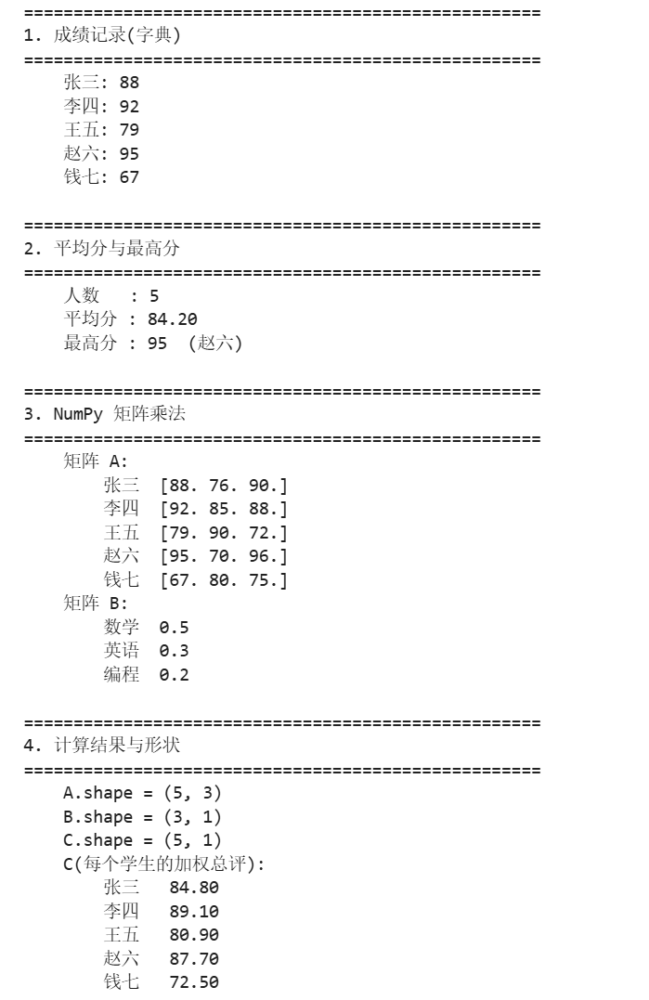

# 机器学习入门学习笔记

## 一、入门笔记

1.机器学习是人工智能的一部分，深度学习又是机器学习的一部分。机器学习不直接把规则（或者说是编程过程）写死，而是给出一定的数据，让机器自行探索其中的规则；深度学习则更进一步，使用多层神经网络来进行学习探索。

2.主要区别在于给到的数据中有无标准答案。监督学习的数据不只有输入，其中还会有一个标准，最终目的就是通过这个标准来匹配这些输入的内容，比如手写数字识别和猫狗识别；而无监督学习则是只有输入，没有所谓的答案，最终的目标不是预测答案,而是发现数据内部的结构，比如聚类行为（实例就是根据用户的行为习惯分类并推荐合适的内容）。

3.数据就类似于样本，放在一起就构成了数据集；特征就像是用于判断数据或者说用于辨认数据的指标；标签就是最终的结果，就像上面提到的“标准答案”；

训练集提供学习的内容，模型反复学习当中数据，调整自身参数，是三个当中占比最大的；验证集在训练中实时监测模型的效果，用来调整超参数，对比不同模型结构，最终选出最合适的；测试集则是最终用于评估模型真实能力，模拟 模型上线后面对真实数据的表现，特别注意：测试集只能使用一次。

4.batch size就是一个数量表示，表示一次给模型若干个样本，然后更新一次参数。影响主要就是两方面，如果batch size太小,好处是更新次数多、前期看起来收敛快,还带一点正则效果；坏处是梯度噪声大、训练曲线上下抖动、GPU 利用率低。如果batch size太大,好处是梯度稳定、能把显存和并行算力吃满；坏处是显存占用高、更新次数变少,有时会停在一个不太好的解上,泛化反而差一点。

5.模型本质就是数学中带未知数的函数，从数据中学习规律，并对未知输入进行预测或判断；而模型参数就是模型内部通过训练自行学习得到的变量，可以说成是学习到的规律的载体。

6.神经网络由输入层、隐藏层、输出层构成，核心是神经元，层与层之间通过权重矩阵连接，每个神经元都带有偏置项。

激活函数是作用于神经元输出的非线性函数，对神经元的加权求和结果做非线性变换。

需要激活函数的原因是如果没有激活函数，无论堆叠多少层神经网络，整体都等价于一个线性变换，只能拟合线性关系，激活函数则是引入了非线性表达能力，让神经网络可以拟合复杂的非线性数据规律。

常见的激活函数有：ReLU--f(x)=max(0,x); Sigmoid--f(x)=1/(1+e^-x); Tanh; Softmax; Leaky ReLU等。

7.矩阵求导是多元函数偏导的矩阵化表示，标量对矩阵求导，结果是与原矩阵同型的矩阵，每个位置的元素是标量对原矩阵对应位置元素的偏导数。

8.设输入向量为X（维度n，列向量），权重矩阵为W（维度m×n，m为输出神经元数），偏置向量为b（维度m），激活函数为f。

则前向传播公式：Y=WX+b   A=f(Y)

其中Y是加权求和结果，A是该层最终输出。批量输入时，X为n×N矩阵（N为样本数），偏置通过广播机制参与计算。

9.前向传播是指输入数据从输入层进入，逐层经过加权求和、激活函数计算，最终在输出层得到预测结果的过程，作用是计算模型预测值；反向传播是指以预测值与真实值的误差为起点，从输出层向输入层反向传递，利用链式法则逐层计算损失函数对每个权重、偏置的梯度，为参数更新提供依据。

损失函数用于衡量模型预测值与真实值的差异程度，是神经网络训练的优化目标，训练目标是让损失最小化；梯度是损失函数对参数的偏导数，指示参数更新的方向和幅度（负梯度方向是损失下降最快的方向）；学习率用来控制每次参数更新的步长，步长过大会导致训练震荡不收敛，步长过小会导致收敛速度慢，易陷入局部最优。

10.优化器是根据损失函数计算出的梯度，按照特定策略更新网络参数，从而最小化损失函数的算法。

常见的优化器有：SGD、Momentum、AdaGrad、RMSprop、Adam。

11.过拟合：模型在训练集上表现优异，但在测试集/未知数据上表现很差，原因是模型过度学习了训练集的噪声和细节，泛化能力弱。

欠拟合：模型在训练集和测试集上表现都很差，原因是模型过于简单，没有学习到数据的基本规律。

正则化：一类防止过拟合的技术，通过约束模型复杂度，让模型在训练集精度小幅下降的前提下，大幅提升泛化能力。

## 二、Python热身

代码(在Jupyter lab中运行)：

```python
import sys
import numpy as np

try:
    sys.stdout.reconfigure(encoding="utf-8")
except Exception:
    pass

scores = {
    "张三": 88,
    "李四": 92,
    "王五": 79,
    "赵六": 95,
    "钱七": 67,
}

scores_list = [(name, score) for name, score in scores.items()]


def average_score(data):
    if isinstance(data, dict):
        values = list(data.values())
    else:
        values = [score for _, score in data]

    if not values:
        raise ValueError("成绩为空，无法计算平均分")
    return sum(values) / len(values)


def top_student(data):
    items = list(data.items()) if isinstance(data, dict) else list(data)

    if not items:
        raise ValueError("成绩为空，无法找出最高分")
    return max(items, key=lambda pair: pair[1])


names = list(scores.keys())
subjects = ["数学", "英语", "编程"]

A = np.array(
    [
        [88, 76, 90],
        [92, 85, 88],
        [79, 90, 72],
        [95, 70, 96],
        [67, 80, 75],
    ],
    dtype=float,
)

B = np.array(
    [
        [0.5],
        [0.3],
        [0.2],
    ],
    dtype=float,
)

C = A @ B


def main():
    print("=" * 52)
    print("1. 成绩记录（字典）")
    print("=" * 52)
    for name, score in scores.items():
        print(f"    {name}: {score}")

    print()
    print("=" * 52)
    print("2. 平均分与最高分")
    print("=" * 52)
    print(f"    人数   : {len(scores)}")
    print(f"    平均分 : {average_score(scores):.2f}")
    best_name, best_score = top_student(scores)
    print(f"    最高分 : {best_score}  （{best_name}）")

    print()
    print("=" * 52)
    print("3. NumPy 矩阵乘法")
    print("=" * 52)
    print("    矩阵 A:")
    for i, row in enumerate(A):
        print(f"        {names[i]}  {row}")
    print("    矩阵 B:")
    for j, weight in enumerate(B[:, 0]):
        print(f"        {subjects[j]}  {weight}")

    print()
    print("=" * 52)
    print("4. 计算结果与形状")
    print("=" * 52)
    print(f"    A.shape = {A.shape}")
    print(f"    B.shape = {B.shape}")
    print(f"    C.shape = {C.shape}")
    print("    C（每个学生的加权总评）:")
    for name, value in zip(names, C[:, 0]):
        print(f"        {name}  {value:6.2f}")


if __name__ == "__main__":
    main()
```

运行结果：



## 三、开发环境简答

1.不同项目用不同虚拟环境，主要是为了隔离依赖版本，避免互相冲突并保证可复现，比如不同项目可能需要不同PyTorch、numpy或Python版本，混装容易互相破坏；虚拟环境还能随时删除重建，但显卡驱动仍是全局的。

2.CPU核心少但单核强，适合串行逻辑、分支判断、控制流程和数据预处理；GPU核心多、显存带宽高，适合矩阵乘法、卷积这类大规模并行计算。神经网络训练主要是大量矩阵和张量运算，天然可并行，所以用GPU吞吐更高、训练更快。

3.CUDA是NVIDIA的GPU并行计算平台。PyTorch通过CUDA runtime、cuDNN、cuBLAS等库调用GPU，这些再通过CUDA Driver API和NVIDIA显卡驱动作用到硬件。PyTorch安装包通常自带CUDA runtime，但机器上的全局显卡驱动必须足够新，且虚拟环境无法隔离显卡驱动。
